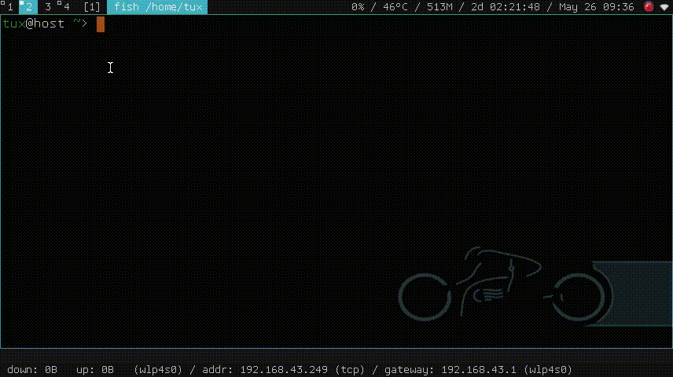

# dorun
dorun adalah sebuah helper Docker sederhana untuk mengelola Container dengan mudah. Anda bisa memasang beberapa aplikasi kesayangan didalam Container tanpa harus mengotori sistem utama anda.
## Prasyarat
* Layanan Docker Harus Sudah Berjalan / Aktif

  Sebelum bisa menjalankan dorun, layanan Docker harus sudah berjalan. Di beberapa distro cek dengan `systemctl status docker`. Silahkan pasang Docker Engine jika belum punya. Ikuti panduan di masing-masing distro. Atau coba ke https://docs.docker.com/engine/install/.
* Bisa Menjalankan Perintah docker Tanpa root

  Agar bisa menjalankan perintah `docker` tanpa root, bisa tambahkan user anda ke group `docker` lalu login ulang agar diterapkan. Cara umum bisa dilihat di https://docs.docker.com/engine/install/linux-postinstall/. Nama group mungkin bisa bervariasi tergantung distro yang anda gunakan. Bisa cek dengan `cat /etc/group`. Apabila grup docker sudah tersedia disana tinggal tambahkan user anda misal dengan perintah `sudo usermod -aG docker user_anda`.
## Instalasi
dorun hanya sebuah skrip Shell yang mana cukup mudah untuk digunakan. Bisa unduh manual atau dengan wget:
```
wget https://raw.githubusercontent.com/gnulinuxid/dorun/master/dorun
```
lalu ubah perijinan agar *executable*:
```
chmod +x dorun
```
## Penggunaan
Silahkan pilih Image distro yang ingin anda gunakan. Image bisa dibuat dengan `Dockerfile` atau ambil langsung dari repo [Docker Hub](https://hub.docker.com/) misalnya dengan `docker pull debian`. Lalu jalankan di terminal:
```
./dorun --image=debian
```
Perintah diatas akan masuk ke Shell. Jika sudah mempunyai program yang terpasang di Container, misal `firefox` bisa dijalankan sebagai berikut:
```
./dorun --image=debian firefox
```
Perintah diatas tentu bisa dijadikan pintasan, atau bisa pasang launcher seperti [rofi](https://github.com/davatorium/rofi) seperti pada demo berikut:


## Troubleshoot
Jika nama user didalam Container adalah `I have no name!` silahkan `exit` lalu jalankan dorun dengan root:
```
sudo ./dorun --image=IMAGE
```
Lalu tambahkan user sesuai dengan user di sistem utama anda, misalnya:
```
useradd user_anda
```
Ganti juga sandi root bila perlu dengan perintah `passwd`. Sehingga nanti bisa dengan mudah berpindah ke root menggunakan `su`.

## Bantuan
Untuk melihat opsi-opsi dorun yang tersedia gunakan:
```
./dorun --help
```
## Peringatan
dorun standarnya berbagi beberapa direktori dengan dengan sistem utama yaitu Documents, Downloads, dll dan bisa baca-tulis. Ini demi kemudahan tetapi saya harap anda bisa waspada. Semua hal yang anda lakukan dengan dorun sepenuhnya adalah tanggung jawab anda sendiri.
