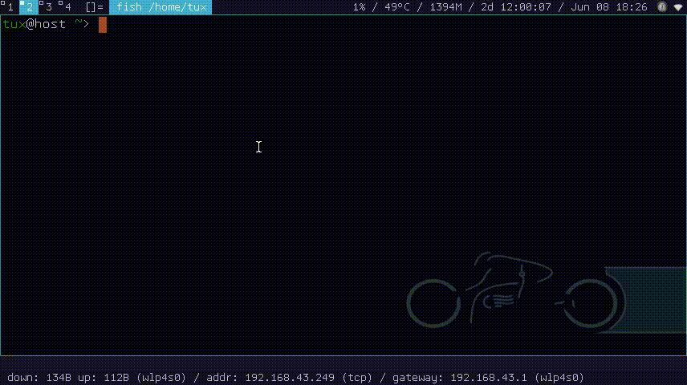

# dorun
dorun is a simple Docker helper to easily manage Containers. You can install some of your favorite apps (either GUI or Non-GUI) inside Container with native experience.
## Prerequisites
* Docker Service Must Already be Running/Active

  Before you can run dorun, the Docker service must be running. In some distros check with `systemctl status docker`. Please install Docker Engine if you don't have one. Follow the guide on each distro. Or try https://docs.docker.com/engine/install/.
* Can run docker commands without root

  In order to run the `docker` command without root, you can add your user to the `docker` group and then re-login to apply. The general method can be seen at https://docs.docker.com/engine/install/linux-postinstall/. The group name may vary depending on the distro you are using. You can check with `cat /etc/group`. If the docker group is already there, just add your user, for example with the command `sudo usermod -aG docker your_user`.
## Installation
dorun is just a shell script which is pretty easy to use. You can download it with wget:
```
wget https://raw.githubusercontent.com/gnulinuxid/dorun/master/dorun
```
then change the permissions to *executable*:
```
chmod +x dorun
```
## Usage
Please choose the distribution image you want to use. Images can be created with `Dockerfile` or fetched directly from the [Docker Hub](https://hub.docker.com/) repo for example with `docker pull debian`. Then run in terminal:
```
./dorun --image=debian
```
The above command will enter the shell. If you already have a program installed in the Container, for example `firefox` then it can be run as follows:
```
./dorun --image=debian firefox
```
The above command can of course be used as a shortcut, or you can install a launcher in the Container, such as [rofi](https://github.com/davatorium/rofi) as in the following demo:


## Wizard Mode
In the previous command example, the `--image=IMAGE` option means using a specific IMAGE. In "Wizard Mode" just use `--image` and it will show the available IMAGE to choose:


## Troubleshoot
If the username in the Container is `I have no name!` please `exit` then run dorun with root:
```
sudo ./dorun --image=IMAGE
```
Then add the user according to the user on your main system, for example:
```
useradd your_user
```
You may also want to set a root password with the `passwd` command. So that later you can easily switch to root using `su`.

## Help
To see available dorun options use:
```
./dorun --help
```
## Warning
dorun by default shares several directories with the main system i.e. Documents, Downloads, etc. and is read-writeable. This is for convenience. But I hope you will be aware. Everything you do with dorun is entirely your own responsibility.
